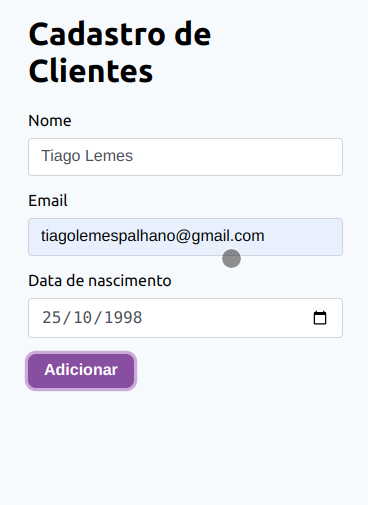

  

# 📝 Formulário de Validação em React

Este é um projeto React criado para aprimorar conhecimentos sobre validação de formulários utilizando React.

## 🎯 Objetivo

O objetivo principal deste projeto é explorar e praticar diferentes técnicas de validação de formulários em aplicações React. Ele foi desenvolvido como parte de um estudo pessoal para entender e aplicar as melhores práticas de validação de dados inseridos pelo usuário.

## 🚀 Funcionalidades

- Implementação de validação de entrada de dados em formulários React.
- Utilização de bibliotecas ou métodos para validação assíncrona, se necessário.
- Apresentação de feedback visual ao usuário sobre erros de validação.
- Demonstração de como lidar com diferentes tipos de campos e regras de validação.

## 🛠️ Tecnologias Utilizadas

- React
- Formik
- Yup
- JavaScript/ES6

## ⚙️ Instalação

1. Clone este repositório: https://github.com/tiagoskaterock/react-validacao-de-formularios
2. Acesse o diretório do projeto: `cd react-form-validation`
3. Instale as dependências: `npm install`

## ▶️ Uso
Execute o projeto utilizando o comando: `npm start`

  

